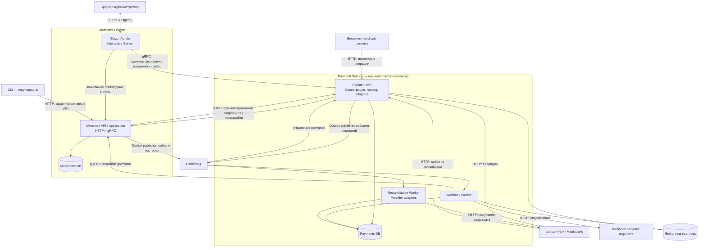

# Way2Pay — архитектура приложения

**Статус:** проект целевой архитектуры для утверждения.  
**Дата:** 6 октября 2026 года.  
**Функциональные требования:** [req.md](req.md).

Документ описывает приложение целиком: его состав, владельцев данных, взаимодействие компонентов, инфраструктуру и последовательность разработки. Базовые решения из обсуждения зафиксированы ниже; новые предложения явно отмечены. Детальные таблицы, состояния, API-контракты и настройки инфраструктуры проектируются на следующем уровне.

## 1. Назначение и границы системы

Way2Pay — платформа обработки электронных платежей. Она предоставляет внешним merchant-системам единый API, выбирает платёжного провайдера, выполняет операции, восстанавливает их результат при сбоях и уведомляет мерчантов.

Проект развивается от курсовой по теме «Проектирование базы данных системы обработки электронных платежей» к дипломной работе. С первого этапа используется целевая архитектура с двумя самостоятельными БД. Этапы отличаются полнотой реализованных функций; временное объединение сервисов или перенос владения данными между ними не планируются.

В границы Way2Pay входят:

- управление мерчантами, доступом и настройками интеграции;
- обработка и история платёжных операций;
- настройка и выполнение правил маршрутизации;
- интеграция с несколькими провайдерами;
- безопасное переключение провайдера и восстановление неопределённых операций;
- доставка уведомлений;
- веб-администрирование, аудит и наблюдаемость.

Внешний магазин мерчанта и банковский процессинг находятся за границами платформы. Mock Bank и демонстрационный клиент относятся к окружению разработки и защиты.

Chargebee служит ориентиром для настройки маршрутизации и обзора прохождения платежей, Authorize.net — для модели операций и взаимодействия со шлюзом. Подписки, тарифные планы, выставление счетов, собственные балансы и бухгалтерский ledger пока не входят в согласованный объём. Их добавление потребует отдельного архитектурного решения.

## 2. Основные архитектурные решения

1. **Два сервиса — владельца данных:** Merchant Service и Payment Service.
2. **Две бизнес-БД:** Merchants DB и Payments DB. У каждой свой DbContext и свои миграции EF Core Code First.
3. **Платёжный контур запускается несколькими процессами:** Payment API, Webhook Worker и Reconciliation Worker. Они используют общие прикладные правила и Payments DB. Платёжный жизненный цикл реализован как персистентная последовательность шагов с идемпотентным приёмом запросов (см. req.md, разделы 9–11); Reconciliation Worker восстанавливает шаги, ожидающие ответ провайдера.
4. **Веб-админка встроена в Merchant Service:** Blazor Web App с режимом Interactive Server. Она запускается и выпускается вместе с Merchant API. CLI — дополнительный клиент тех же административных возможностей.
5. **HTTP используется для внешних интеграций, gRPC — для внутренних синхронных вызовов, RabbitMQ — для асинхронных событий.**
6. **Redis используется как кеш.** Финансовая история и работа, которую необходимо восстановить после сбоя, сохраняются в SQL Server.
7. **Маршрутизация и адаптеры провайдеров входят в Payment Service.** Отдельные сервисы для них в целевой схеме не требуются.
8. **Один репозиторий и одно основное solution.** Общий репозиторий не означает общую модель данных двух сервисов.

Получается четыре основных серверных приложения: Merchant API со встроенной админкой, Payment API и два worker-приложения. При этом самостоятельных границ владения данными две. Браузер открывает админку Merchant Service; отдельного серверного приложения для неё нет. Возможный CLI, Mock Bank и инструменты инфраструктуры считаются отдельно.

## 3. Общая схема



Стрелки обозначают основные взаимодействия, а не последовательность одного запроса. Reconciliation Worker также самостоятельно находит незавершённую работу в Payments DB. Redis и RabbitMQ не читают бизнес-таблицы самостоятельно — с ними работают приложения.

Blazor Admin и Merchant API находятся в одном процессе. Админка вызывает функции управления мерчантами локально через Application, а функции платёжного контура — через его административный gRPC-контракт. Владение платёжными данными и правилами сохраняется в Payment Service. Подход и его обоснование описаны в разделе 8.

## 4. Ответственность приложений

| Приложение / компонент | Ответственность | Данные |
|---|---|---|
| **Merchant API** | Регистрация и управление мерчантами; ключи; доступ; настройки интеграции; пользователи; размещение Blazor-админки; HTTP/gRPC-контракты | Владеет Merchants DB |
| **Payment API** | Внешний платёжный API; выполнение операций; routing; provider adapters; приём событий банков; административные функции платёжного контура | Владеет Payments DB совместно со своими workers в рамках одного сервиса |
| **Webhook Worker** | Отправка событий внешним мерчантам; повторная доставка; журнал результатов | Использует Payments DB и настройки из Merchant Service |
| **Reconciliation Worker** | Поиск неопределённых и зависших операций; запрос результата у провайдера; согласованное обновление состояния | Использует Payments DB и provider adapters |
| **Outbox publishers** | Публикация сохранённых событий своего сервиса в RabbitMQ | Читают Outbox только своего сервиса |
| **Blazor Admin — модуль Merchant Service** | Настройка системы, редактор правил, просмотр платежей, действия оператора | Merchant Application вызывается локально; Payment Service — по gRPC |
| **Admin CLI — опционально** | Автоматизируемые административные команды, импорт и экспорт настроек | Использует те же прикладные возможности через API |
| **Mock Bank** | Независимая имитация провайдера с управляемыми результатами и сбоями | Собственное тестовое состояние |
| **Demo Merchant — опционально** | Демонстрация создания платежа, checkout и приёма уведомлений | Собственные демонстрационные данные |

Outbox publishers являются фоновыми компонентами соответствующих API-приложений. Отдельное приложение Publisher в обязательную структуру не добавляется.

Payment API и его workers используют общие Domain/Application/Infrastructure-библиотеки. Это осознанная граница одного сервиса с несколькими процессами. Они согласованно обновляют схему и правила; независимое изменение схемы одним worker недопустимо.

## 5. Владение данными

### 5.1. Merchants DB

Здесь находятся исходные данные мерчанта и его доступа:

- мерчанты, статус подключения и административные сведения;
- API-ключи, их полномочия и отзыв;
- пользователи, роли и принадлежность пользователей к мерчантам;
- разрешённые мерчанту подключения провайдеров;
- webhook endpoints, подписки на события и данные для управления секретами подписи;
- версии настроек;
- аудит изменений в этом сервисе и его Outbox.

Merchant Service не хранит копию всей истории платежей для вывода её в админке: эти данные запрашиваются у Payment Service.

### 5.2. Payments DB

Здесь находятся платёжные данные и конфигурация обработки:

- платежи, операции, попытки обращения к провайдерам;
- история состояний и результаты внешних взаимодействий;
- ссылки на платёжные методы и токены с указанием их провайдера;
- каталог провайдеров, их аккаунты, возможности, состояние доступности и ссылки на секреты подключения;
- политики и версии правил маршрутизации;
- решения движка: кандидаты, выбранный провайдер и причины выбора;
- записи идемпотентности;
- работа по reconciliation и её история;
- события, задания на webhook-доставку и попытки доставки;
- технические записи надёжной обработки: Outbox, Inbox и незавершённая работа;
- аудит действий в платёжном контуре.

Различаем **разрешение мерчанту использовать подключение** и **техническую конфигурацию подключения к провайдеру**. Первым владеет Merchant Service, второй — Payment Service. Правила выбора провайдера, включая правила конкретного мерчанта, также принадлежат Payment Service.

### 5.3. Связи между БД

Между базами передаются идентификаторы и контракты. Межбазовых внешних ключей, прямых SQL JOIN и чтения чужих таблиц нет. Проверка существования и доступности связанных объектов выполняется через API сервисов. Межсервисные изменения не считаются общей SQL-транзакцией: ошибки и незавершённые настройки должны быть видны оператору и допускать повторное завершение.

Payment Service хранит MerchantId и необходимые снимки использованных настроек. Такие снимки объясняют историческую операцию; менять актуальные настройки мерчанта через Payments DB нельзя. Мерчантов и подключения с финансовой историей деактивируют с сохранением ссылок.

Для локального окружения обе базы могут находиться на одном SQL Server, но используют раздельные учётные данные и миграции. Redis является дополнительным техническим хранилищем, поэтому «две БД» в документе означает две основные бизнес-БД.

## 6. Основные потоки работы

### 6.1. Приём и выполнение платежа

1. Внешняя merchant-система отправляет платёжный запрос в Payment API.
2. Payment Service проверяет доступ через Merchant Service и получает нужный контекст мерчанта.
3. В Payments DB сохраняются платёжная операция и данные, необходимые для защиты от повтора и восстановления работы.
4. Routing Engine выбирает доступное подключение по действующей политике.
5. Provider Adapter выполняет вызов внешнего провайдера.
6. Результат, история и событие сохраняются в Payments DB. Событие затем публикуется через Outbox.
7. Мерчант получает ответ HTTP, а при асинхронном завершении — узнаёт результат через GET или webhook.

Обрыв клиентского соединения не означает отмену уже принятой операции. После принятия работа должна восстанавливаться по данным БД. Для длительных сценариев API возвращает идентификатор и признак незавершённой обработки.

### 6.2. Неопределённый результат

Если нельзя доказать результат денежного вызова, операция переходит в неопределённое состояние. Reconciliation Worker запрашивает результат у того же провайдера; ответ банка или его webhook завершает обработку через общие прикладные правила.

До выяснения результата повторное списание через другого провайдера запрещено. Неустранимая неопределённость становится задачей для оператора. Сбой одной операции, например возврата, не должен стирать ранее подтверждённый финансовый результат платежа.

### 6.3. Уведомление мерчанта

Webhook Worker получает событие, определяет получателя по настройкам Merchant Service и создаёт устойчивую запись доставки в Payments DB. Затем отправляет отдельный HTTP-запрос на внешний endpoint мерчанта и сохраняет результат.

Адрес, версия конфигурации и содержание конкретной доставки сохраняются для объяснимых повторов. Отключение endpoint и отзыв секрета имеют приоритет над историческим снимком. Неуспешная доставка не меняет финансовый результат платежа.

### 6.4. Изменение настроек

Админка направляет изменение владельцу данных. Merchant Service изменяет параметры мерчанта; Payment Service публикует правила маршрутизации или меняет конфигурацию провайдеров. Изменения аудируются. События об изменениях обновляют или инвалидируют кеши потребителей.

## 7. Routing Engine и интеграции

Routing Engine — модуль Payment Service. Он использует конфигурацию из Payments DB, разрешения мерчанта, данные платежа и доступность провайдеров.

Архитектура предусматривает:

- редактируемые черновики и неизменяемые опубликованные версии политик;
- явный порядок применения правил и поведение при отсутствии подходящего провайдера;
- проверку правил на тестовых данных без денежного вызова;
- сохранение версии политики и объяснения решения;
- проверку обязательных ограничений до выбора: возможностей провайдера, доступа, валюты, платёжного метода;
- повторную проверку изменяемых ограничений перед фактическим вызовом.

Provider Adapter преобразует внутренние операции и результаты в модель конкретного банка. Разные адаптеры могут поддерживать разные возможности. Authorize, charge, capture, cancel и refund имеют общие прикладные контракты, но доступность операции определяется состоянием платежа и возможностями выбранного подключения.

Capture, cancel и refund связаны с исходной транзакцией и обычно выполняются через её провайдера. Токен одного провайдера также не считается автоматически пригодным для другого. Эти ограничения входят в модель системы с начала разработки.

Исходящие денежные вызовы выполняются по специальной политике повторов. Общие настройки retry HTTP-клиента не должны автоматически повторять такие операции. Переключение провайдера и повторное обращение к тому же провайдеру — решения платёжной логики.

## 8. Веб-админка, CLI и доступ

Веб-админка включает следующие области:

| Область | Возможности |
|---|---|
| Мерчанты | Настройки, ключи, разрешённые подключения, webhook endpoints |
| Правила | Создание, проверка, публикация и просмотр версий политик |
| Платежи | Поиск, фильтрация, подробности и временная линия прохождения |
| Провайдеры | Конфигурация подключений, поддерживаемые операции и доступность |
| Восстановление | Неопределённые операции, результаты сверки, допустимые действия оператора |
| Доставка событий | Состояние webhook, попытки и управляемый повтор доставки |
| Аудит | Кто, когда и какие настройки или операции изменил |

Путь платежа показывает платёж → операции → routing decisions → попытки → результаты → сверку → уведомления. Он восстанавливается из бизнес-истории Payments DB. Техническая трассировка дополняет эту историю.

**Согласованное решение:** Blazor Web App с режимом Interactive Server размещается в том же ASP.NET Core приложении, что и Merchant API. Компоненты интерфейса выполняются на сервере и взаимодействуют с браузером через SignalR. Встроенная админка использует пользователей, роли и прикладные функции Merchant Service.

Управление мерчантами, ключами и webhook endpoints выполняется локальными вызовами Merchant Application. Просмотр платежей, настройка routing и платёжные действия выполняются через внутренний административный gRPC API Payment Service. Blazor-компоненты не обращаются напрямую к Payments DB и не содержат бизнес-правил платёжного контура.

Интерфейс оформляется как Razor Class Library `Way2Pay.Merchants.Admin`, подключённая к Merchant API. Это позволяет отделить страницы и компоненты внутри solution, сохраняя единый процесс запуска и развёртывания. Для платёжных экранов используются клиенты контрактов Payment Service. Пользовательские черновики и результаты существенных действий сохраняются устойчиво, а не только в состоянии открытого интерфейса.

**Обоснование совместного размещения:** управление мерчантами и админка используют общую модель пользователей, прав и настроек. Ожидается ограниченное число одновременно работающих административных пользователей; независимое масштабирование UI и Merchant API не является текущим требованием. Совместное размещение упрощает развёртывание и сопровождение системы для курсовой и диплома.

Авторизация ограничивает круг пользователей, но сама по себе не ограничивает нагрузку. История выдаётся постранично, диапазон и длительность поиска ограничиваются, дорогие действия имеют лимиты, длительные задачи выполняются в фоне. Payment Service контролирует нагрузку своих административных запросов на Payments DB.

Админка и Merchant API имеют общую границу доступности: перезапуск или перегрузка процесса затрагивает обе функции, включая проверку доступа для новых платёжных запросов. Этот компромисс принимается осознанно. Interactive Server также требует учитывать серверное состояние и соединения пользователей при масштабировании; подключение Redis само по себе не решает восстановление Blazor-сессий.

Пользовательская аутентификация — ASP.NET Core Identity в Merchant Service с защищённой cookie-сессией и защитой HTTP-запросов изменения данных от CSRF. Действия компонентов также проходят серверную авторизацию. Пользователи админки и API-ключи внешних мерчантов — разные виды доступа. CLI, если реализуется, получает собственный ограниченный способ авторизации к административным HTTP API, использующим те же прикладные функции.

С первого этапа проектируются роли и область доступа: администратор платформы, оператор, наблюдатель, пользователь конкретного мерчанта. Конкретный набор ролей уточняется при проектировании доступа. Сервисы проверяют полномочия на сервере; скрытие кнопки в UI не заменяет проверку.

Внутренние вызовы аутентифицируют вызывающий сервис и передают доверенный контекст пользователя для авторизации и аудита. Внешний клиент не может подставить такой контекст обычным заголовком. Payment Service проверяет право на запрашиваемое действие и принадлежность платежа мерчанту.

## 9. Инфраструктура и сторонние инструменты

| Технология | Назначение | Место в целевой системе |
|---|---|---|
| **.NET 10 / ASP.NET Core** | HTTP/gRPC API и фоновые приложения | Основной backend; соответствует направлению текущего проекта |
| **EF Core Code First** | Модели хранения, конфигурации, миграции | Отдельно для каждой бизнес-БД |
| **SQL Server** | Устойчивое хранение бизнес-данных, транзакции, ограничения, запросы | Merchants DB и Payments DB |
| **gRPC / Protobuf** | Внутренние синхронные контракты | Между владельцами данных и их потребителями |
| **RabbitMQ** | Доставка событий и сигналов фоновой обработки | Связывает сервисы и workers |
| **Redis** | Общий кеш разрешённых к кешированию настроек | Используется потребителями Merchant Service; не заменяет SQL |
| **ASP.NET Core Identity** | Учётные записи и аутентификация админки | Внутри Merchant Service |
| **Blazor Web App / Interactive Server / SignalR** | Встроенная серверная админка и взаимодействие с браузером | Размещается вместе с Merchant API; UI-модуль — Razor Class Library |
| **.NET Aspire AppHost** | Запуск локального окружения, зависимости, адреса сервисов и dashboard | Средство разработки и демонстрации |
| **Docker** | SQL Server, Redis, RabbitMQ и воспроизводимые образы приложений | Окружение разработки и развёртывания |
| **OpenTelemetry + Aspire Dashboard** | Логи, метрики, трассировка, диагностика | Базовая наблюдаемость |
| **OpenAPI** | Описание внешних и административных HTTP API | Интеграция и проверка контрактов |
| **xUnit + Testcontainers** | Проверка правил и интеграций с настоящими инфраструктурными зависимостями | Предлагаемый набор для тестирования |
| **Prometheus / Grafana / хранилище трассировок** | Долговременный мониторинг | Необязательное расширение для диплома |

Aspire не является частью платёжной логики и не заменяет план развёртывания. Для автономного запуска окружения предусматривается Docker Compose. Версии SDK, NuGet-пакетов и контейнеров фиксируются в репозитории при реализации.

Kubernetes, service mesh, отдельная аналитическая БД, поисковый кластер и внешний workflow engine не входят в обязательную архитектуру. Для описанных функций пока нет потребности добавлять эти зависимости.

## 10. Роль Redis и RabbitMQ

### Redis

Источник настроек мерчанта — Merchants DB. Payment Service и Webhook Worker используют кеш и обращаются к Merchant Service по gRPC при отсутствии данных. Версия, срок жизни и события изменения ограничивают использование устаревших настроек.

Кеш допускает временное расхождение с источником. Решения об отзыве API-ключа, блокировке мерчанта и отключении webhook требуют отдельной политики актуальности; их нельзя объявить мгновенными только за счёт Redis. Базовый выбор — проверять критичные разрешения через Merchant Service, сохраняя кеш для обычной конфигурации. Недоступность проверки приостанавливает новое защищённое действие.

Очистка Redis не должна уничтожать платежи, защиту от повторов, историю или задания доставки. Устойчивые снимки конкретных решений хранятся в Payments DB.

### RabbitMQ

Каждый сервис сохраняет событие в своём Outbox вместе с изменением данных. Его publisher доставляет событие в RabbitMQ. Получатели учитывают повторную доставку и сохраняют результат обработки устойчиво.

Заранее различаются сообщения о событиях и команды на выполнение действий. Общий порядок сообщений между всеми потребителями не предполагается. Восстановление незавершённой работы опирается на БД, в том числе если уведомление из очереди задержалось.

Недоступность RabbitMQ задерживает фоновые уведомления; события остаются в Outbox. Очередь не становится источником финансового состояния. Необработанные сообщения и окончательно неудачные доставки должны быть доступны оператору.

Для обоих механизмов предусматриваются ограниченные повторы и диагностируемое состояние ошибки. Сроки и интервалы относятся к конфигурации реализации.

## 11. Надёжность и эксплуатационные границы

| Ситуация | Архитектурное поведение |
|---|---|
| Повторный запрос мерчанта | Та же операция распознаётся по сохранённой идемпотентности; конфликт содержимого отклоняется |
| Провайдер мог выполнить операцию, но ответ потерян | Фиксируется неопределённость; выполняется сверка без нового списания |
| API, webhook банка и worker одновременно обрабатывают платёж | Общие правила и контроль конкурентного обновления защищают согласованность |
| Приложение упало между вызовом банка и записью результата | Сохранённая попытка позволяет найти незавершённую работу и запросить результат |
| Merchant Service недоступен | Новые действия, требующие проверки доступа, не выполняются; уже принятые платежи могут восстанавливаться по сохранённому контексту |
| Redis недоступен | Чтение конфигурации обращается к её владельцу; нагрузка может вырасти |
| RabbitMQ недоступен | Outbox сохраняет события до восстановления доставки |
| Сайт мерчанта недоступен | Webhook повторяется по политике доставки; платёж сохраняет свой результат |
| Payments DB недоступна | Новые денежные вызовы не начинаются без возможности сохранить их контекст |

Workers могут запускаться в нескольких экземплярах. Захват работы и защита от повторных денежных действий обеспечиваются устойчивыми данными и правилами обработки. Истечение времени ожидания само по себе не доказывает, что внешняя операция не выполнялась.

Полная недоступность Merchant Service может задерживать webhook, если требуется актуальная проверка endpoint или секрет подписи. Это осознанная зависимость: снимок URL не отменяет правила доступа.

## 12. Защита данных, аудит и наблюдаемость

Платформа предусматривает изоляцию данных мерчантов, разграничение административных прав, аутентификацию внутренних вызовов и защищённые соединения. Секреты провайдеров, ключи и пароли не попадают в исходники, события, открытые ответы и журналы. Способ хранения секретов допускает локальные защищённые настройки для разработки и отдельное хранилище секретов при развёртывании.

Платёжные реквизиты передаются через токенизацию или hosted payment form провайдера. Хранение PAN/CVV в Way2Pay не предусматривается. Адреса исходящих webhook контролируются, чтобы функция доставки не давала произвольный доступ к внутренней сети приложения.

Входящие webhook провайдера проверяются и сопоставляются с существующей операцией. Исходящие события подписываются, чтобы мерчант мог проверить источник. Тестовые и реальные подключения, ключи и данные должны быть явно разделены.

Аудит бизнес-действий хранится у владельца данных. Correlation ID связывает HTTP/gRPC-вызовы, сообщения, операции и технические логи. Наблюдаемость охватывает задержки обработки, ошибки провайдеров, неопределённые операции, очередь восстановления и состояние доставки уведомлений.

Веб-админка является инструментом оператора платформы. Aspire Dashboard и RabbitMQ Management остаются техническими инструментами разработчика и эксплуатации.

## 13. Структура репозитория и зависимости

Предлагаемая целевая структура использует названия Merchants и Payments для двух сервисов. Внутри Payments оркестратор остаётся основным прикладным механизмом.

```text
Way2Pay/
├── req.md
├── ARCHITECTURE.md
├── Way2Pay.slnx
├── src/
│   ├── Merchants/
│   │   ├── Way2Pay.Merchants.Api/
│   │   ├── Way2Pay.Merchants.Admin/            # Razor Class Library; размещается в Api
│   │   ├── Way2Pay.Merchants.Domain/
│   │   ├── Way2Pay.Merchants.Application/
│   │   ├── Way2Pay.Merchants.Infrastructure/
│   │   │   └── Persistence/Migrations/
│   │   └── Way2Pay.Merchants.Contracts/
│   ├── Payments/
│   │   ├── Way2Pay.Payments.Api/
│   │   ├── Way2Pay.Payments.Domain/
│   │   ├── Way2Pay.Payments.Application/
│   │   ├── Way2Pay.Payments.Infrastructure/
│   │   │   ├── Persistence/Migrations/
│   │   │   └── Providers/
│   │   ├── Way2Pay.Payments.Contracts/
│   │   ├── Way2Pay.Payments.Webhooks.Worker/
│   │   └── Way2Pay.Payments.Reconciliation.Worker/
│   ├── Admin/
│   │   └── Way2Pay.Admin.Cli/                 # опционально
│   ├── Sandbox/
│   │   ├── Way2Pay.MockBank/
│   │   └── Way2Pay.DemoMerchant/              # опционально
│   ├── Way2Pay.AppHost/
│   └── Way2Pay.ServiceDefaults/
├── tests/
│   ├── Merchants/
│   ├── Payments/
│   ├── Contracts/
│   └── EndToEnd/
├── deploy/
│   └── compose.yaml
└── docs/
    ├── database/
    └── decisions/
```

- **Domain:** предметные сущности, правила и ограничения, независимые от EF, HTTP и RabbitMQ.
- **Application:** сценарии использования и интерфейсы необходимых внешних возможностей.
- **Infrastructure:** EF Core, адаптеры провайдеров, транспорт сообщений, кеш, клиенты сервисов.
- **Api / Worker:** точки запуска и подключение зависимостей; используют прикладные сценарии.
- **Contracts:** внешние DTO, protobuf и схемы событий своего сервиса; не EF-сущности.
- **Merchants.Admin:** страницы и компоненты Blazor; вызывает Merchant Application локально и Payment Service через gRPC-контракты. Размещается и выпускается вместе с Merchants.Api.
- **ServiceDefaults:** общие технические настройки наблюдаемости и подключения инфраструктуры.

Application зависит от Domain, Infrastructure реализует прикладные интерфейсы, исполняемые приложения собирают зависимости. Merchant Service не ссылается на Domain/Infrastructure платёжного сервиса и наоборот. Общие бизнес-сущности и универсальная библиотека всех репозиториев между сервисами не вводятся.

Миграции каждой БД принадлежат одному проекту. В развёртывании их применяет отдельный шаг, а не каждый экземпляр API и worker одновременно. Специфичные для SQL Server объекты допустимо создавать SQL внутри миграций; схема при этом остаётся управляемой Code First.

Существующие SQL-проект и Generated EF-сущности являются исходным материалом для пересмотра. В новой структуре не будет двух конкурирующих способов изменения одной схемы. Перестройка репозитория выполняется отдельной задачей после согласования документа; этот файл сам по себе не означает, что она уже выполнена.

## 14. Mock Bank и внешние интеграции

Mock Bank запускается отдельно и воспроизводит успех, отказ, задержку, недоступность и потерю ответа после выполнения операции. Для проверки переключения нужны минимум два логических провайдера либо два экземпляра mock-окружения.

Для восстановления результата mock сохраняет собственную историю в независимом тестовом хранилище, например SQLite с Docker volume. Это хранилище принадлежит имитации внешнего банка и не входит в две бизнес-БД Way2Pay. Mock не читает Payments DB и не вызывает внутренние методы оркестратора.

Реальный sandbox-провайдер подключается через тот же контракт адаптера. Authorize.net является кандидатом, а не уже выбранной обязательной интеграцией. Доступность sandbox, поддерживаемые методы и требования подключения проверяются перед реализацией адаптера.

В req.md сейчас есть два блока ограничений, один из которых допускает live-операции. Архитектура сохраняет возможность отдельного live-окружения, но реальные платежи не являются условием защиты курсовой. Конкретное включение live-режима остаётся отдельным решением.

## 15. Курсовая и диплом

Ниже — предлагаемый объём этапов. Формальные требования кафедры к оформлению, SQL-объектам и демонстрации ещё нужно сверить с методическими указаниями.

| Часть | Для курсовой | Для диплома |
|---|---|---|
| Два сервиса и две БД | Границы, модели и отдельные Code First-миграции с начала разработки | Развитие тех же сервисов |
| Проектирование БД | ER-модели, нормализация, связи, ограничения, индексы, словарь данных, обоснование снимков и истории | Дополнение моделей и анализ нагрузки |
| Платёжная модель | Платёж, операции, попытки, routing, история, идемпотентность | Расширение поддерживаемых сценариев |
| Merchant Service | Мерчанты, ключи, права и конфигурация, необходимые для работы системы | Полный административный набор возможностей |
| Mock Bank | Рабочая демонстрация успеха и отказов | Расширенные сценарии и тестирование сбоев |
| Reconciliation и webhooks | Модель хранения и контракты входят в фундамент; полная автоматизация может не входить в объём защиты БД | Рабочие самостоятельные workers и восстановление после сбоев |
| RabbitMQ / Outbox / Inbox | Архитектура и модели надёжной обработки предусмотрены; полная интеграция необязательна для защиты БД | Полный асинхронный поток |
| Redis | Контракт кеширования предусмотрен; запуск Redis необязателен для защиты БД | Кеш с согласованной политикой актуальности |
| Встроенная Blazor-админка | Рабочие экраны в Merchant Service для демонстрации данных, настройки и истории | Полный редактор правил и инструменты оператора в том же UI-модуле |
| CLI | Необязателен | Необязателен; добавляется при практической пользе |
| Наблюдаемость | Базовые логи и диагностика | Трассировка, метрики и обзор состояния всей системы |
| Реальный провайдер | Необязателен | Желателен sandbox-адаптер; live отдельно |
| Эксплуатация | Воспроизводимый запуск и сохранность данных | Автоматизация развёртывания, восстановление резервных копий, нагрузочные испытания |

Необязательность компонента для защиты означает возможность не завершать его реализацию к этой дате. Она не означает временную смену владельца данных или замену целевой архитектуры демонстрационной схемой. Таблицы и миграции добавляются последовательно внутри заранее определённого владельца.

Проверки должны подтверждать ограничения БД, одновременную обработку запросов, отсутствие повторного денежного эффекта, восстановление неопределённого результата, повторную доставку сообщений и изоляцию мерчантов. Для диплома добавляются испытания остановки и перезапуска приложений и инфраструктуры.

## 16. Что проектировать следующим

1. Утвердить этот состав приложений, владельцев данных и административный вход.
2. Построить концептуальные и логические модели обеих БД, включая связь платежа, операции и попытки.
3. Зафиксировать основные API/gRPC/событийные контракты, модель доступа и финансовые сценарии.
4. Создать целевую структуру solution и отдельные Code First-модели с миграциями.
5. Реализовывать функции внутри этих границ, начиная с материала, необходимого для защиты курсовой.

На следующем уровне потребуется выбрать семантику создания платежа, поддержку частичных capture/refund, набор валют, конкретного sandbox-провайдера, срок хранения истории и точную политику изменения webhook endpoints. Это влияет на модель и контракты, но не требует менять описанные границы приложений.

Подход к админке согласован: встроенный Blazor Interactive Server в Merchant Service, локальные вызовы Merchant Application и gRPC к Payment Service, общие пользователи и роли на ASP.NET Core Identity. Тестовое хранилище Mock Bank остаётся предложением для отдельного утверждения.

## 17. Источники для проверки технических решений

Внешние материалы использованы для проверки ограничений инструментов. Распределение ответственности и структура Way2Pay являются проектным решением этого документа.

- [EF Core: контроль конкурентных изменений](https://learn.microsoft.com/en-us/ef/core/saving/concurrency).
- [RabbitMQ: надёжность, подтверждения и повторная доставка](https://www.rabbitmq.com/docs/reliability).
- [Microsoft: cache-aside и ограничения согласованности кеша](https://learn.microsoft.com/en-us/azure/architecture/patterns/cache-aside).
- [.NET HTTP resilience: настройка повторов денежных HTTP-вызовов](https://learn.microsoft.com/en-us/dotnet/core/resilience/http-resilience).
- [Blazor Web App: режимы рендеринга](https://learn.microsoft.com/en-us/aspnet/core/blazor/components/render-modes?view=aspnetcore-10.0).
- [Blazor: аутентификация и авторизация](https://learn.microsoft.com/en-us/aspnet/core/blazor/security/?view=aspnetcore-10.0).
- [Blazor: управление серверным состоянием](https://learn.microsoft.com/en-us/aspnet/core/blazor/state-management/server?view=aspnetcore-10.0).
- [Chargebee: настройка, публикация и проверка правил маршрутизации](https://www.chargebee.com/docs/payments/2.0/payment-gateways-and-configuration/advanced-routing-rules).
- [Chargebee: Gateway Activity Logs](https://www.chargebee.com/docs/payments/2.0/payment-lifecycle-logs/gateway-activity-logs).
- [Authorize.net: типы и ограничения платёжных операций](https://developer.authorize.net/api/reference/features/payment-transactions.html).
- [Authorize.net: hosted payment form](https://developer.authorize.net/api/reference/features/accept-hosted.html).
